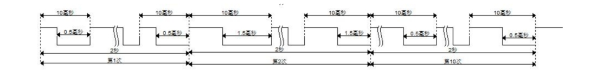

PWM呼吸灯

#### <b>设计目标</b>
上电后，LED 灯显示接近于灭，随后每隔 2 秒亮度发生一次变化，在前 10 秒时间内，每隔 2 秒逐渐变亮。在下一个 10 秒时间内，每隔 2秒，亮度逐渐变暗。简单来说即是以 20 秒为一次循环，每隔 2 秒变化一次，前 10 秒亮度逐渐增大，后 10 秒亮度逐渐减小。LED灯逐渐变亮和逐渐变暗的过程，可以通过设置周期的占空比(高电平占周期的时间)来决定。也就是说，占空比逐渐变小，LED灯就会逐渐变亮。注意，我们的时钟周期一直定为20ns。所以本实验规定：
1. 第一个2s内，占空比为95%。
2. 第二个2s内，占空比为85%。
3. 第三个2s内，占空比为70%。
4. 第四个2s内，占空比为50%。
5. 第五个2s内，占空比为20%。
6. 第六个2s内，占空比为20%。
7. 第七个2s内，占空比为50%。
8. 第八个2s内，占空比为70%。
9. 第九个2s内，占空比为85%。
10. 第十个2s内，占空比为95%。

#### <b>设计思路</b>
根据经验来说，PWM的周期可以设置为10ms。通过波形图分析，我们需要设置三个计数器来进行计数。
1. cnt0来数10ms时间，注意我们开始数的是clk时钟周期（20ns）。也就是说，我们要数10ms内包含了多少个clk。
2. cnt1来计算2s内包含了多少个10ms
3. cnt2来计算循环周期。

#### <b>实验总结</b>
跟前面的一位闪烁灯和四位闪烁灯一样，我们首先都是要先以clk周期为基本单位，进行计数。但是，具体计数到多少截至，就需要根据我们的输出波形来确定。我们的最终目的就是怎么设计计数器以及设计多少个计数器可以更加方便的展示出我们的输出波形的高低电平的变化。

***
***

PWM breathing light

#### <b>Design Goals</b>
After powering on, the LED light is almost off, and then changes in brightness every 2 seconds. In the first 10 seconds, it gradually gets brighter every 2 seconds. During the next 10 seconds, the brightness gradually dims every 2 seconds. To put it simply, it takes 20 seconds as a cycle and changes every 2 seconds. The brightness gradually increases in the first 10 seconds and gradually decreases in the next 10 seconds. The process of the LED light gradually brightening and dimming can be determined by setting the duty cycle of the cycle (the time the high level occupies the cycle). In other words, as the duty cycle gradually becomes smaller, the LED light will gradually become brighter. Note that our clock period has always been set to 20ns. Therefore, this experiment stipulates:
1. Within the first 2s, the duty cycle is 95%.
2. Within the second 2s, the duty cycle is 85%.
3. Within the third 2s, the duty cycle is 70%.
4. Within the fourth 2s, the duty cycle is 50%.
5. Within the fifth 2s, the duty cycle is 20%.
6. Within the sixth 2s, the duty cycle is 20%.
7. Within the seventh 2s, the duty cycle is 50%.
8. Within the eighth 2s, the duty cycle is 70%.
9. Within the ninth 2s, the duty cycle is 85%.
10. Within the tenth 2s, the duty cycle is 95%.

#### <b>Design ideas</b>
According to experience, the PWM period can be set to 10ms. Through waveform analysis, we need to set up three counters for counting.
1. Use cnt0 to count the 10ms time. Note that we start counting the clk clock cycle (20ns). In other words, we have to count how many clks are included in 10ms.
2. cnt1 to calculate how many 10ms are included in 2s.
3. cnt2 to calculate the cycle period.

#### <b>Experimental Summary</b>
Just like the previous one-digit flashing light and four-digit flashing light, we first need to count the clk cycle as the basic unit. However, the specific counting end needs to be determined based on our output waveform. Our ultimate goal is how to design a counter and how many counters to design to more conveniently display the changes in the high and low levels of our output waveform.